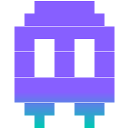

<table>
<tr>
<td valign="middle">

Wisp 👻 is a lightweight, background daemon that allows you to spawn "terminal emulator agnostic" PTY sessions and share them across multiple clients. Start a session on your PC, join it via an SSH tunnel, hop in from an iPad using Blink/Termius, and type together in real-time. It's like having an invisible entity sharing your keyboard!

</td>
<td align="center" valign="middle" width="240">

</td>
</tr>
</table>

## Features

- **Shared PTY Sessions**: Multiple clients connect to the exact same underlying shell (defaulting to your `$SHELL` or `zsh`).
- **Daemon Architecture**: Spin up one daemon, manage infinite terminal sessions across different ports seamlessly.
- **Dynamic Resizing**: Automatically calculates the "minimum viable dimension" across all active clients so your UI never breaks.
- **TUI Pause Menu**: Type `!>` quickly to pause your client interaction and selectively disconnect, leaving everyone else perfectly undisturbed.
- **Lifecycle Management**: Spin sessions `up`, bring them `down`, or `kill` them completely via UUID.

## Installation

```bash
git clone https://github.com/Fuabioo/wisp
cd wisp
go build -o wisp
```

## Usage

1. Start the daemon (usually in a background task or screen/tmux):
   ```bash
   ./wisp daemon
   ```

2. Start a new shared server session:
   ```bash
   ./wisp server --port 8082
   ```

3. See active sessions:
   ```bash
   ./wisp ps
   ```

4. Connect to a session (locally or remotely via your IP/Cloudflare Tunnel):
   ```bash
   ssh -p 8082 localhost
   ```

5. Manage session state:
   ```bash
   ./wisp down <uuid>
   ./wisp up <uuid>
   ./wisp kill <uuid>
   ```

## Menu
While in an active shared session, type `!>` rapidly to open the Pause Menu!

## Prior art

The category is usually called **terminal session sharing** (or "collaborative shell" / "shared PTY" at the technical level). Notable neighbors:

- **[tmate](https://tmate.io/)** — the canonical reference. Forked from tmux, ships sessions through a public relay.
- **[upterm](https://github.com/owenthereal/upterm)** — Go daemon with a similar daemon-plus-fan-out-PTY shape; the closest architectural cousin to wisp.
- **[sshx](https://sshx.io/)** — modern, browser-based take on the same idea.
- **GNU `screen -x`** and **`tmux attach`** — the local-only ancestors.
- **Teleconsole** (archived, by the Teleport authors) and **Warp**'s collaboration mode (proprietary, GUI) round out the lineage.

What makes wisp distinct in that lineup: no relay (self-hosted, direct SSH), an in-band escape digraph (`!>`) into a bubbletea pause menu, and per-axis "minimum viable dimension" resize so a small client never breaks the others.

## Primitive for…

Wisp is really *a controllable, observable, multi-attach PTY exposed over a clean RPC*. That makes it a useful Lego brick beyond "two humans typing together":

- **AI-agent observability.** Spawn the agent inside a wisp session. Humans `wisp up` to watch live, intervene through the pause menu, then `down` without killing the agent — a DVR for autonomous coding agents.
- **Real-time peer steering for agents.** Two (or more) agents attached to the same shell, coordinating like human pair-programmers — one drives, others observe and nudge. See the swarm orchestration TODO.
- **Attended automation / approval gates.** A CI job or deploy script runs in a wisp PTY; on a sensitive step it pauses and pings a human to attach and confirm. Pairs naturally with the planned hooks system.
- **Classroom and livecoding broadcast.** Many read-only attachees, one driver.
- **Remote support / shoulder-surf debugging.** A customer attaches their session, you join — like tmate, but on infrastructure you own.
- **Recording infrastructure.** Wrap any command in wisp to get asciinema-shaped output for free.

The strategic shape: wisp is best understood as a **daemon-as-platform**, where the RPC surface is a public API and other tools (agent harnesses, CI runners, support portals) embed sessions as a first-class primitive.
